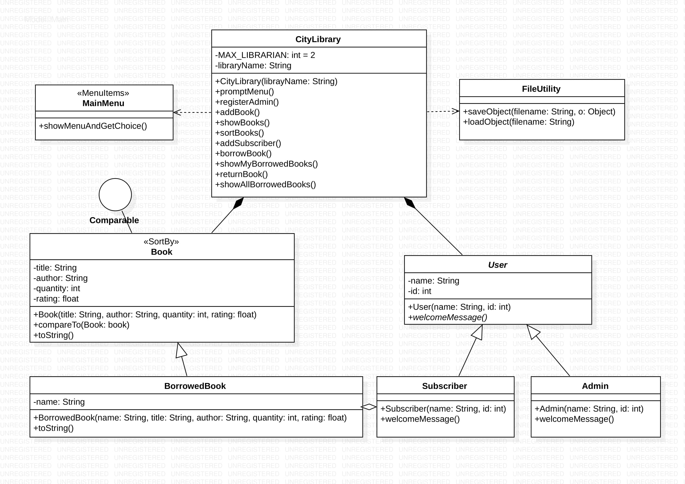

# CITY LIBRARY
‘City Library’ is a simple library program, where users are admin, subscriber or any 
person. In this program an admin can register and add book to the Library book’s list. 
And subscriber can register or login by ‘username’ and ‘pin-code’. This program’s code 
has been written by Java JDK 13.0.1

 > @author Maruf Ahmed
 >   @version 1.2.0
 >  @since 2019.10.29
> 
> <b>Login function has been added in this version 1.2.0</b>
> To get the older version 1.1.0, clone from branch vs110
#### UML DIAGRAM

#### FUNCTIONALITIES
 * Users can see all available books and sort books by 'title' or 'author'.
 * Subscribers can only borrow books after they are loggedin.
 * If a subscriber borrows a book, the book's quantity will be subtracted. 
 By returning the book, the quantity will be added again.
 * While returning the book, subscribes can also add 'rating' which is a float
 number (0.1 to 5.0).  Rating book is optional, that means the user cna skip
 that option just by pressing enter.
 * All data will be saved in files. So those data can be retrieved after restart
 the program.

> Feel free to ask me if you have any questions at maruf.ahmed@live.se

