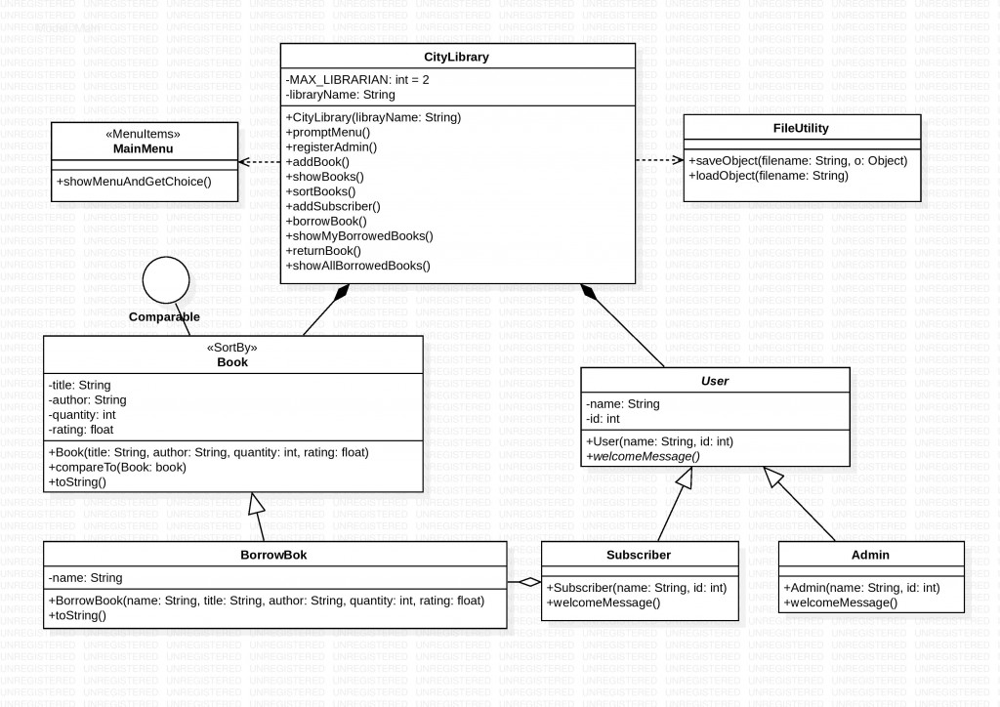

# CITY LIBRARY
Library Program, where the Admin can Register and add Books.
Subscribers can Register and Borrow/Return Books.

#### UML DIAGRAM

#### FUNCTIONALITIES
 * Users can see all available books and sort books by 'title' or 'author'.
 * If a subscriber borrow a book, the book's quantity will be subtracted. 
 By returning back the book, the quantity will be added again.
 * While returning back the book, subscribes can also add 'rating' which is a float
 number (0.1 to 5.0).  Rating book is optional, that means the user cna skip
 that option just by pressing enter.
 * All data will be saved in files. So those data can be retrieved after restart
 the program.
 > @author Maruf Ahmed
 >   @version 1.0.1
 >  @since 2019.10.16